# Mybatis源码

## 阅读源码的最好的方式：

1. 理解主流程
2. debug，找主流程的主要类和方法
3. 带着问题（譬如一些常见面试题）debug

‍

这里有一份阅读Mybatis源码的意见，可以作为参考

https://zhuanlan.zhihu.com/p/269761503

‍

### Mybatis执行流程：

​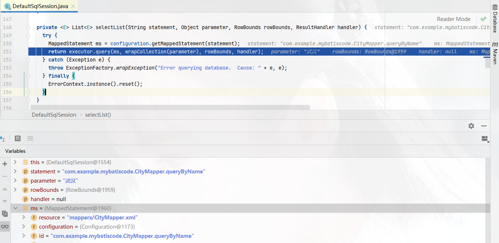​

1. 解析主配置文件，初始化`SqlSessionFactory`​​​

    ```java
    org.apache.ibatis.session.SqlSessionFactoryBuilder#build(java.io.InputStream, java.lang.String, java.util.Properties) {
    	XMLConfigBuilder parser = new XMLConfigBuilder(inputStream, environment, properties);
        return build(parser.parse());
    }

    org.apache.ibatis.builder.xml.XMLConfigBuilder#parseConfiguration(XNode root) { 
    	...
    	// 读取environments配置，初始化TransactionFactory 和 DataSourceFactory 
    	environmentsElement(root.evalNode("environments"));
    	+--  TransactionFactory txFactory = transactionManagerElement(child.evalNode("transactionManager"));
        +--   DataSourceFactory dsFactory = dataSourceElement(child.evalNode("dataSource"));
    	...
    	// 读取mappers配置，并关联读取mapper.xml
    	mapperElement(root.evalNode("mappers"));
    }
    ```

    * 解析mapper.xml (org.apache.ibatis.builder.xml.XMLMapperBuilder#configurationElement)

      ​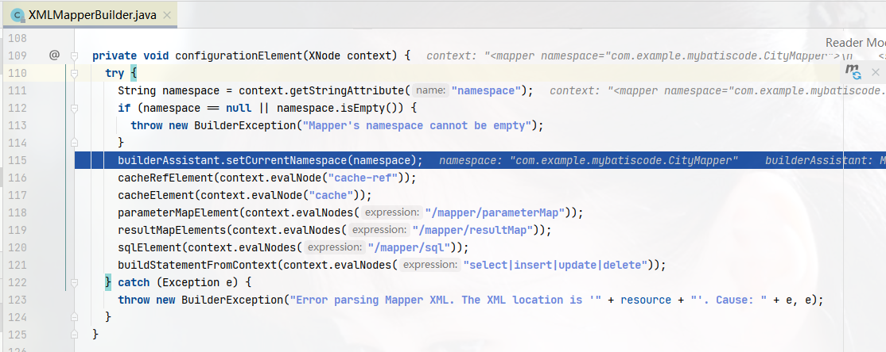​

   ‍
2. 获取`session`​​​ ，开启事务

   ​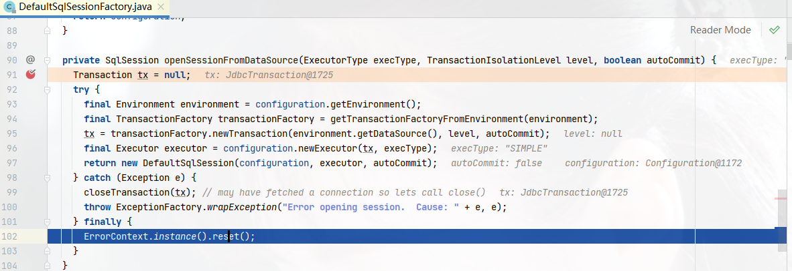​

3. 获取mapper

   ​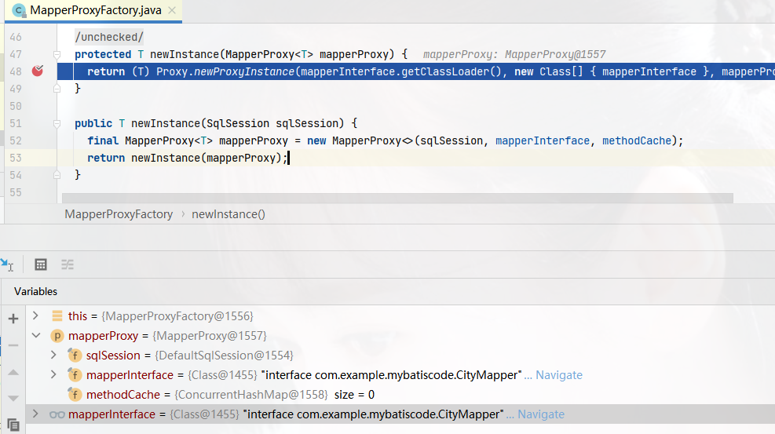​

   这里其实并没有生成Mapper的实例，因为本身就没有实现类。而是通过`MapperProxyFactory`​创建了一个代理对象。

   ​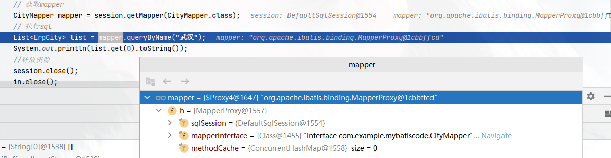​

4. 预编译

    * 代理方法根据Sql类型调用相应的方法

   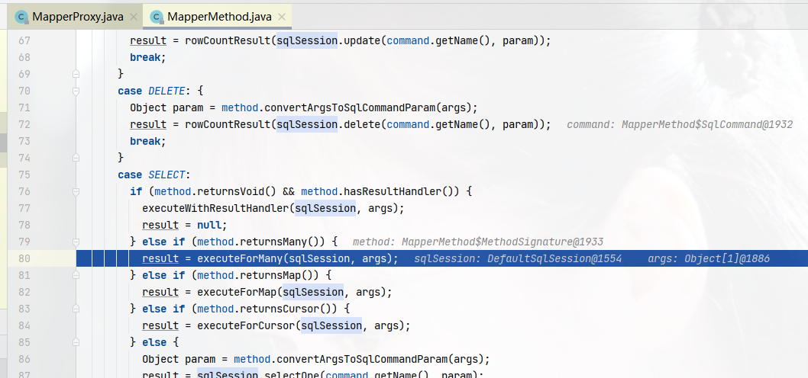	​

* 通过执行器调用查询	 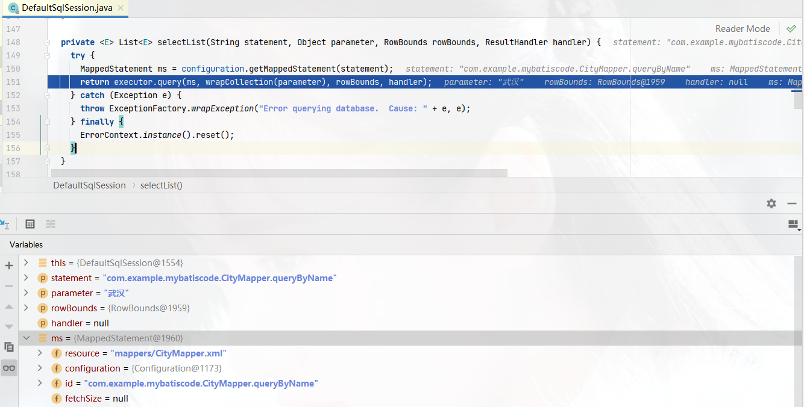​

* ​`StatementHandler`​预编译

  ​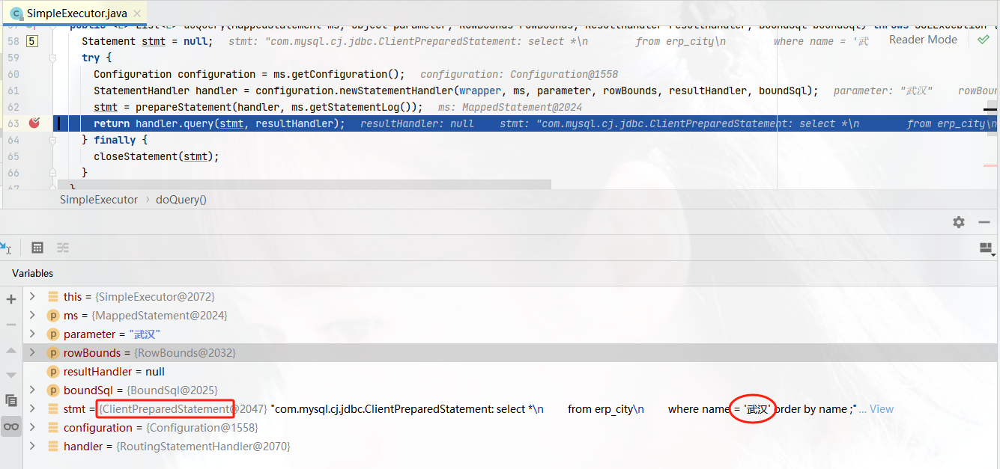​

5. 执行并解析结果集	​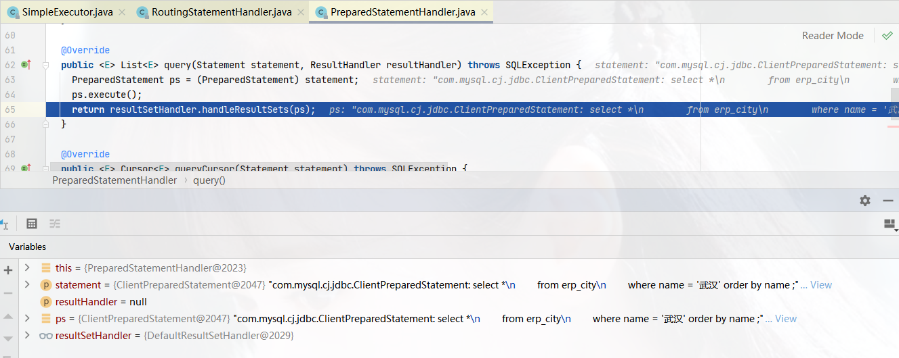​

    * 调用ObjectFactory创建需要的类型

   ​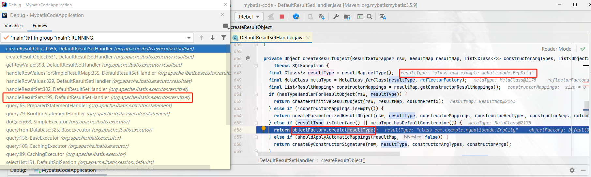​

    * 绑定数据库字段和目标resultType属性的对应关系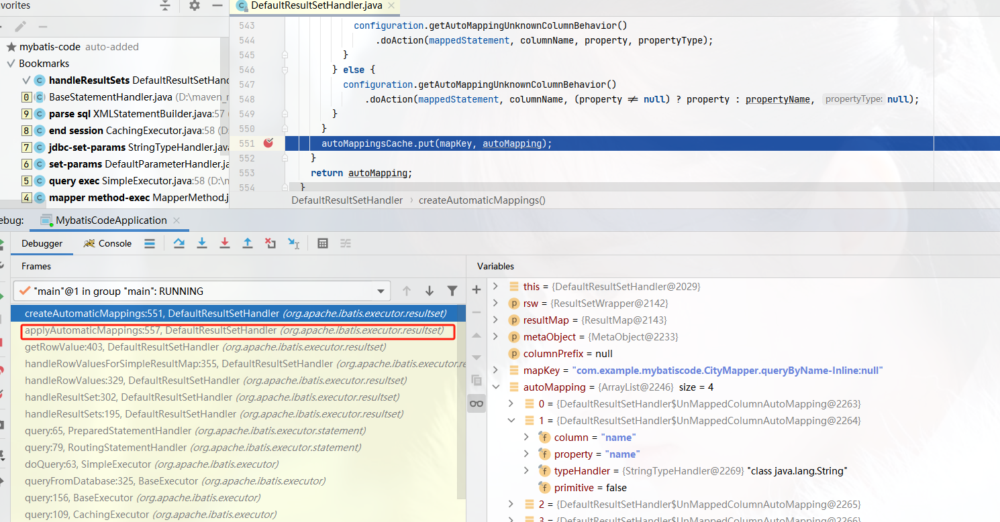​

        * 从rs中取值并对应到metadata​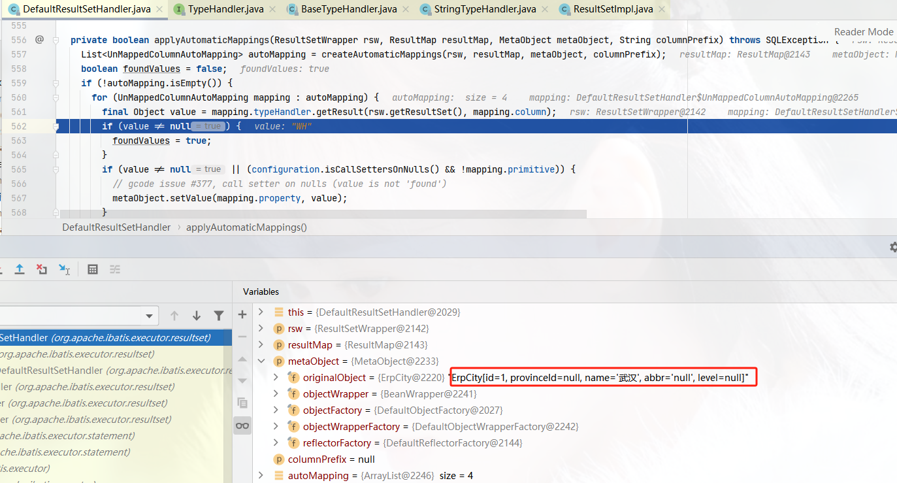​

      ‍

‍

‍

## Mybatis插件机制

‍

> 看了下mybatis的一些面试题，没啥新鲜的。都是一些应用常识，在跟进几次源码的执行后，心里就大致有个印象了。
>
> 下面看看Mybatis的插件机制是如何实现的，这里还是以最常见的分页插件为例。

‍

如何使用参考[[官网]](https://pagehelper.github.io/docs/howtouse/)

‍

### 1 插件都会被注册成为拦截器

​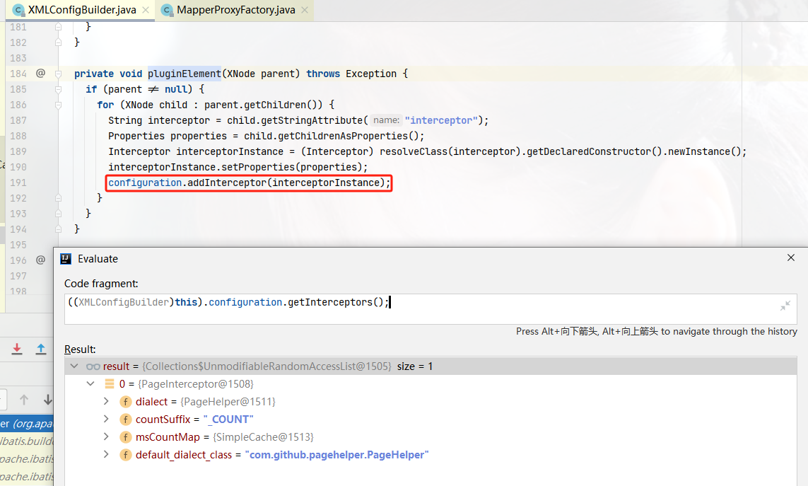​

‍

### 2 `Plugin是拦截器的实现，执行SQL时候会通过动态代理调用PageHelper中的拦截方法`​

拦截器中，对doBoundSql本身的处理；

>  需要注意的是：
>
> ​`ExecutorUtil.executeAutoCount`​ 方法会把参数拦截、以及Mybatis的相关查询都会执行一次，用户获取count

​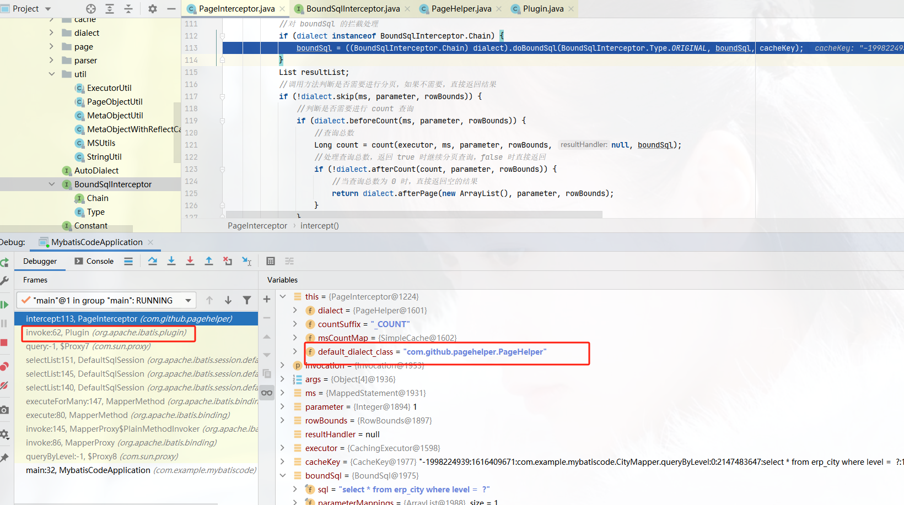​

ExecutorUtil.pageQuery 设置完成boundSql后，在预处理的时候，会遍历参数Mappings根据index真正设置参数

​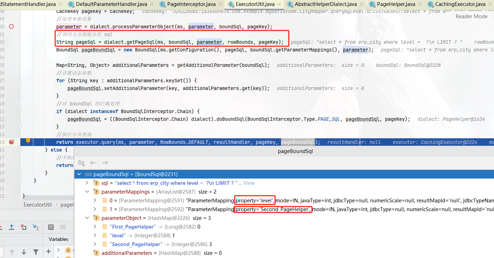​

​​

#### 分页插件总结

* PageInterceptor

  分页插件的入口，通过实现Mybatis的拦截器进入；如果要分页，先获取count，再添加分页参数查询，并封装Page返回
* Dialect

  方言：也实现了pageHelper的扩展，包含是否分页判定、前置后置等
* BoundSqlInterceptor

  一个链式BoundSql 处理器，在分页前中后可对原sql变更
* PageHelper

  分页插件的主类（implements Dialect, BoundSqlInterceptor.Chain），分页逻辑的主题逻辑入口类

  ‍

‍

---

## Q: JDBC如何通过问号表达式防止SQL注入？

>  预编译会标识该位置为参数类型，而不是原生SQL， 这个设定是MYSQL协议支持的。

‍

>  创建一个PreparedStatement对象，用于向数据库发送参数化的SQL语句。 可以预编译带有或不带有IN参数的SQL语句，并将其存储在PreparedStatement对象中。然后可以使用该对象多次有效地执行该语句。

java.sql.Connection#prepareStatement(java.lang.String)

java.sql.PreparedStatement#setString

‍

预处理协议：

https://dev.mysql.com/doc/dev/mysql-server/latest/page_protocol_com_stmt_prepare.html

‍

‍

‍
